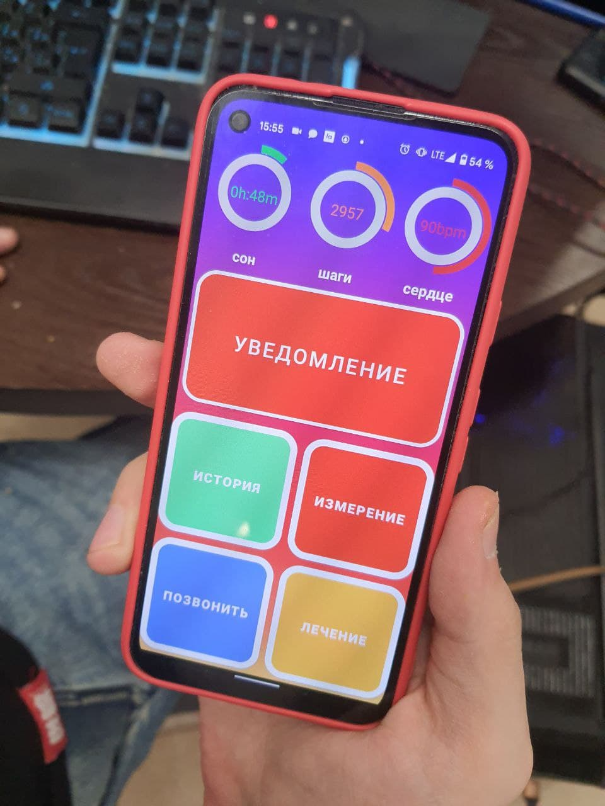
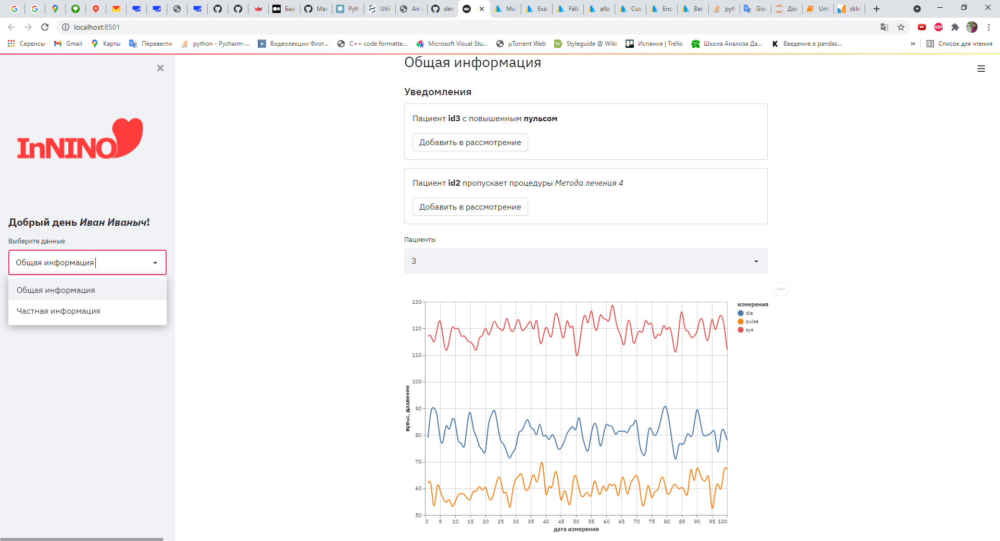

# КОМАНДА INNINO

### Разработка системы дистанционного мониторинга уровня артериального давления и пульса у больных с артериальной гипертензией

# В Проекте представлены модули
## Android приложение --> DP2021 ссылка на [APK](https://drive.google.com/file/d/1XpF7GD9HkbSW6mOrqPruHO-I-639gMIw/view?usp=sharing)
### Языка JAVA
      
## Server --> server, web-app [пример приложения](http://152.70.48.2034:8501)
### Языка Python

## Модуль, приминявшийся в обучении сети для распознования данных с танометра. 

